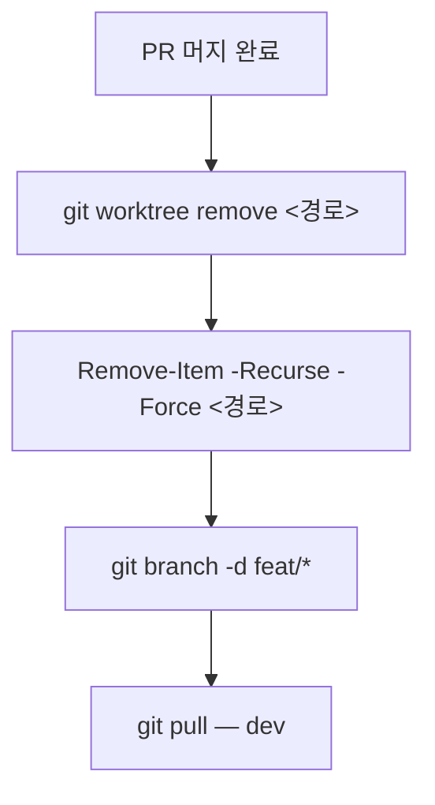

# Git 전략 — Cinelog

## 브랜치 전략

브랜치 흐름: `<prefix>/*` → `dev` → `main`

**브랜치 prefix 컨벤션:**

| prefix      | 용도                          |
| ----------- | ----------------------------- |
| `feat/`     | 새 기능 추가                  |
| `fix/`      | 버그 수정                     |
| `docs/`     | 문서 작성·수정                |
| `refactor/` | 코드 리팩토링                 |
| `chore/`    | 설정·빌드·패키지 등 기타 작업 |
| `test/`     | 테스트 추가·수정              |

- 하나의 브랜치에 두 개 이상의 작업을 섞지 않는다
- `feat/*` 브랜치를 `main`에 직접 병합하지 않는다
- `feat/*` 브랜치를 `dev` 검증 없이 `main`으로 올리지 않는다
- `dev`에서 검증이 완료되지 않은 상태로 `main`에 병합하지 않는다
- 충돌 해결을 `main`에서 하지 않는다 — 반드시 `feat/*` → `dev` 단계에서 해결한다
- `dev`에 병합이 완료된 로컬 브랜치를 남기지 않는다 — 머지 후 `git branch -d <브랜치명>`으로 즉시 삭제한다

## Git Worktree

- 순차 작업에 worktree를 사용하지 않는다 — 병렬 작업이 필요할 때만 생성한다
- worktree 디렉토리명에 브랜치명을 반영한다
- 같은 브랜치를 두 worktree에 동시에 체크아웃하지 않는다

### Worktree 생성

새 브랜치를 만들면서 worktree를 생성할 때는 반드시 `-b` 플래그를 사용한다.
존재하지 않는 브랜치명을 `-b` 없이 지정하면 `invalid reference` 에러가 발생한다.

```bash
# 새 브랜치 + worktree 동시 생성 (기반 브랜치에서 분기)
git worktree add -b <브랜치명> <경로> <기반브랜치>

# 예시
git worktree add -b docs/update-notion-docs ../quiz-app-docs-update-notion dev
git worktree add -b feat/some-feature ../quiz-app-feat-some-feature dev

# 이미 존재하는 브랜치를 체크아웃할 때는 -b 없이 사용
git worktree add <경로> <브랜치명>
```

### Worktree 정리 워크플로우


